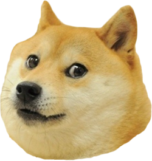

<div align="center">
    
    <h5><code>many add</code>, <code>such commit</code>, <code>very push</code></h5>
    <h1><code>git-wow</code></h4>
</div>

### many features
```console
$ many add .
$ such commit
$ very push

$ wow
```

### "Shut up and take my money!"
Add to your `~/.bashrc` profile.
```console
$ curl -s http://tiny.cc/git-wow >> ~/.bashrc
```

### much faq
#### Q. "Is this some kind of joke?"
Yes, yes it is.

#### Q. "One word, why?"
We're a meme-driven world.

### what license
This repository has been released under the [WTF Public License](LICENSE).